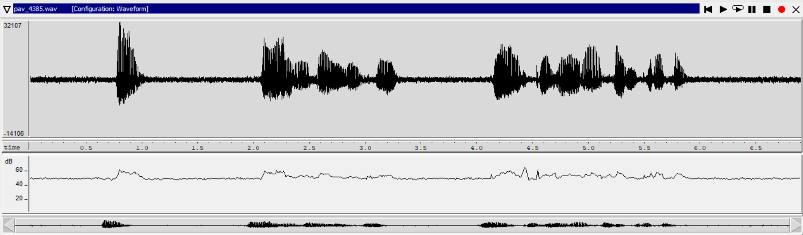
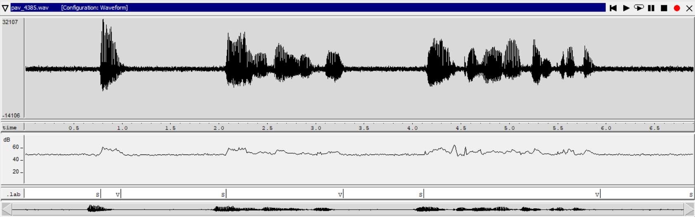
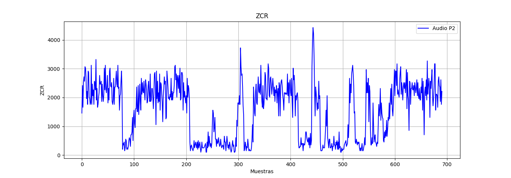
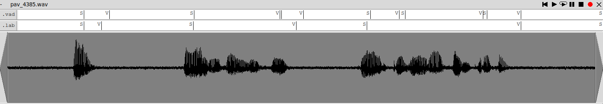
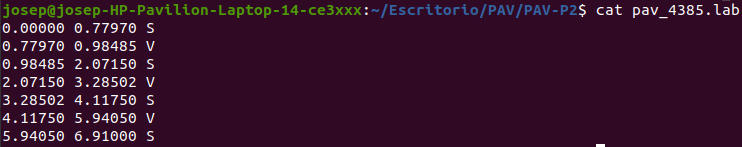
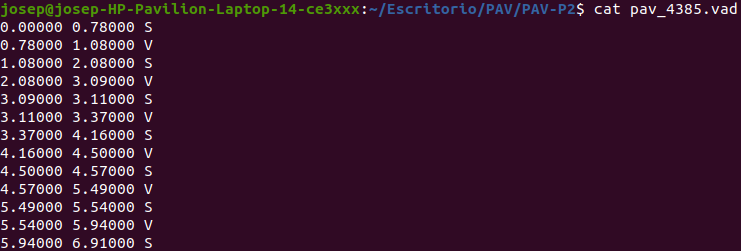
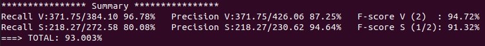

PAV - P2: detección de actividad vocal (VAD)
============================================

Esta práctica se distribuye a través del repositorio GitHub [Práctica 2](https://github.com/albino-pav/P2),
y una parte de su gestión se realizará mediante esta web de trabajo colaborativo.  Al contrario que Git,
GitHub se gestiona completamente desde un entorno gráfico bastante intuitivo. Además, está razonablemente
documentado, tanto internamente, mediante sus [Guías de GitHub](https://guides.github.com/), como
externamente, mediante infinidad de tutoriales, guías y vídeos disponibles gratuitamente en internet.


Inicialización del repositorio de la práctica.
----------------------------------------------

Para cargar los ficheros en su ordenador personal debe seguir los pasos siguientes:

*	Abra una cuenta GitHub para gestionar esta y el resto de prácticas del curso.
*	Cree un repositorio GitHub con el contenido inicial de la práctica (sólo debe hacerlo uno de los
	integrantes del grupo de laboratorio, cuya página GitHub actuará de repositorio central del grupo):
	-	Acceda la página de la [Práctica 2](https://github.com/albino-pav/P2).
	-	En la parte superior derecha encontrará el botón **`Fork`**. Apriételo y, después de unos segundos,
		se creará en su cuenta GitHub un proyecto con el mismo nombre (**P2**). Si ya tuviera uno con ese 
		nombre, se utilizará el nombre **P2-1**, y así sucesivamente.
*	Habilite al resto de miembros del grupo como *colaboradores* del proyecto; de este modo, podrán
	subir sus modificaciones al repositorio central:
	-	En la página principal del repositorio, en la pestaña **:gear:`Settings`**, escoja la opción 
		**Collaborators** y añada a su compañero de prácticas.
	-	Éste recibirá un email solicitándole confirmación. Una vez confirmado, tanto él como el
		propietario podrán gestionar el repositorio, por ejemplo: crear ramas en él o subir las
		modificaciones de su directorio local de trabajo al repositorio GitHub.
*	En la página principal del repositorio, localice el botón **Branch: master** y úselo para crear
	una rama nueva con los primeros apellidos de los integrantes del equipo de prácticas separados por
	guion (**fulano-mengano**).
*	Todos los miembros del grupo deben realizar su copia local en su ordenador personal.
	-	Copie la dirección de su copia del repositorio apretando en el botón **Clone or download**.
		Asegúrese de usar *Clone with HTTPS*.
	-	Abra una sesión de Bash en su ordenador personal y vaya al directorio **PAV**. Desde ahí, ejecute:

		```.sh
		git clone dirección-del-fork-de-la-práctica
		```

	-	Vaya al directorio de la práctica `cd P2`.
	-	Añada la etiqueta `origin` a su copia del repositorio. Esto es útil para facilitar los *push* y
		*pull* al repositorio original:
		```.sh
		git remote add origin dirección-del-fork-de-la-práctica
		```
	-	Cambie a la rama **fulano-mengano** con la orden:

		```.sh
		git checkout fulano-mengano
		```

*	A partir de este momento, todos los miembros del grupo de prácticas pueden trabajar en su directorio
	local del modo habitual.
	-	También puede utilizar el repositorio remoto como repositorio central para el trabajo colaborativo
		de los distintos miembros del grupo de prácticas; o puede serle útil usarlo como copia de
		seguridad.
	-	Cada vez que quiera subir sus cambios locales al repositorio GitHub deberá confirmar los
		cambios en su directorio local:

		```.sh
		git add .
		git commit -m "Mensaje del commit"
		```

		y, a continuación, subirlos con la orden:

		```.sh
		git push -u origin fulano-mengano
		```

*	Al final de la práctica, la rama **fulano-mengano** del repositorio GitHub servirá para remitir la
	práctica para su evaluación utilizando el mecanismo *pull request*.
	-	Vaya a la página principal de la copia del repositorio y asegúrese de estar en la rama
		**fulano-mengano**.
	-	Pulse en el botón **New pull request**, y siga las instrucciones de GitHub.


Entrega de la práctica.
-----------------------

Responda, en este mismo documento (README.md), los ejercicios indicados a continuación. Este documento es
un fichero de texto escrito con un formato denominado _**markdown**_. La principal característica de este
formato es que, manteniendo la legibilidad cuando se visualiza con herramientas en modo texto (`more`,
`less`, editores varios, ...), permite amplias posibilidades de visualización con formato en una amplia
gama de aplicaciones; muy notablemente, **GitHub**, **Doxygen** y **Facebook** (ciertamente, :eyes:).

En GitHub. cuando existe un fichero denominado README.md en el directorio raíz de un repositorio, se
interpreta y muestra al entrar en el repositorio.

Debe redactar las respuestas a los ejercicios usando Markdown. Puede encontrar información acerca de su
sintáxis en la página web [Sintaxis de Markdown](https://daringfireball.net/projects/markdown/syntax).
También puede consultar el documento adjunto [MARKDOWN.md](MARKDOWN.md), en el que se enumeran los
elementos más relevantes para completar la redacción de esta práctica.

Recuerde realizar el *pull request* una vez completada la práctica.

Ejercicios
----------

### Etiquetado manual de los segmentos de voz y silencio

- Etiquete manualmente los segmentos de voz y silencio del fichero grabado al efecto. Inserte, a 
  continuación, una captura de `wavesurfer` en la que se vea con claridad la señal temporal, el contorno de
  potencia y la tasa de cruces por cero, junto con el etiquetado manual de los segmentos.

_Una vez más hemos realizado una grabación de voz de (16 kHz, mono)  con pausas internas para determinar
en qué instantes tenemos voz y silencio/ruido._

_Comenzamos con la visualización de **la señal** mediante *wavesurfer* donde observamos 
las características más relevantes, *el contorno de potencia*. La tasa de cruces por cero la podemos ver con el script que mostramosa continuación y con elementos de la P1 con `python`._

<br>

_Por otra parte, realizamos el etiquetado manual de los segmentos de silencio(S) y de voz(V) usando
el panel **transcription**._

<br>

- A la vista de la gráfica, indique qué valores considera adecuados para las magnitudes siguientes:

	_Para la obtención de los valores inciales se ha observado las gráficas de `wavesrufer`. Sin embargo a la hora de maximizar la F-score hemos cambiado los umbrales iniciales que decimos a continuación por otros que nos dan mejores resultados._<br>

	* Incremento del nivel potencia en dB, respecto al nivel correspondiente al silencio inicial, para
	estar seguros de que un segmento de señal se corresponde con voz.

		_Se ha detectado que tiene que aumentar aproximadamente 26dB mirando solamente la gráfica._

	* Duración mínima razonable de los segmentos de voz y silencio.

		_A partir de la señal anterior, obtenemos los valores de la duración mínima que corresponde al segmento de la voz ***voice time = 356ms*** y al segmento de silencio ***silence time = 776ms***._

	* ¿Es capaz de sacar alguna conclusión a partir de la evolución de la tasa de cruces por cero?

<br>


_Inicialmente no se pueden sacar datos muy concluyentes. Ya que vemos tramos de silencio con un valor muy elevado de ZCR y también tramos con sonidos sordos con mucho ZCR. Y cuando tenemos un valor elevado de ZCR debido a una cosa u otra también tenemos poca potencia. Así que inicialmente podemos decir esto, pero no es información muy valiosa para realizar una mejora sustancial en el **VAD**. Con `PYTHON`, usando la librería `Matplotlib` hemos hecho este script que funciona con el archivo res.txt generado en la primera práctica y genera una gráfica como la anterior.
._

```python
import matplotlib.pyplot as plt
import numpy as np

newLines = []
res_txt = open("/home/josep/Escritorio/PAV/PAV-P2/python/res.txt","r")
lines = res_txt.readlines()
for x in range(len(lines)):
    newLines.append(lines[x].split("\t"))
    
newestList = []
for x in range(len(newLines)):
    newestList.append(newLines[x][3])

lastesList = []
for x in range(len(newestList)):
    lastesList.append(float(newestList[x].replace("\n","")))

plt.plot(lastesList, 'b-', label='Audio P2')
plt.legend(loc="upper right")
plt.grid()
plt.ylabel('ZCR')
plt.xlabel('Muestras')
plt.title('ZCR')
plt.show()
```


### Desarrollo del detector de actividad vocal

- Complete el código de los ficheros de la práctica para implementar un detector de actividad vocal tan
  exacto como sea posible. Tome como objetivo la maximización de la puntuación-F `TOTAL`.
  
_Código completado y disponible para descargar arriba. Permite alcanzar una puntuación-F del **93.003%**._

- Inserte una gráfica en la que se vea con claridad la señal temporal, el etiquetado manual y la detección
  automática conseguida para el fichero grabado al efecto.

<br>

- Explique, si existen. las discrepancias entre el etiquetado manual y la detección automática.

_En efecto hay ligueras discrepancias, la mayoría producto de tener una duración mínima de los segmentos de silencio muy pequeña en la práctica, pero al aumentar esta se reducía considerablemente la F-score, ya que realizaba las transiciones de voz a silencio demasiado lentas. Así que podemos decir que estas mínimas discrepancias de unos milisegundos son un mal necesario si lo único que se busca maximizar es la F-score, si la métrica a maximizar fuera otra realizaríamos una implementación distinta tratando los tiempos mínimos de forma diferente._

_Para poder visualizadar de una forma más extacta las diferencias entre el etiquetado manual y el del VAD, a continuación se adjunta el resultado del fichero **.lab** y **.vad**._

<br><br>

<br>

- Evalúe los resultados sobre la base de datos `db.v4` con el script `vad_evaluation.pl` e inserte a 
  continuación las tasas de sensibilidad (*recall*) y precisión para el conjunto de la base de datos (sólo
  el resumen).

_Al realizar está evalución y comprobar el funcionamento de nuestro sistema de detección con la base de datos 
que nos proporciona. Vemos que hemos obtenido un **93.003%**. A contuación la tasa de sensibilidad y precisión para el conjunto de la base de datos:._

<br>

_Concluimos que nuestro sistema está preparado para detectar si el segmento es silencio/ruido o
si el segmento es de voz._<br><br>


### Trabajos de ampliación

#### Cancelación del ruido en los segmentos de silencio

- Si ha desarrollado el algoritmo para la cancelación de los segmentos de silencio, inserte una gráfica en
  la que se vea con claridad la señal antes y después de la cancelación (puede que `wavesurfer` no sea la
  mejor opción para esto, ya que no es capaz de visualizar varias señales al mismo tiempo).

#### Gestión de las opciones del programa usando `docopt_c`

- Si ha usado `docopt_c` para realizar la gestión de las opciones y argumentos del programa `vad`, inserte
  una captura de pantalla en la que se vea el mensaje de ayuda del programa.


### Contribuciones adicionales y/o comentarios acerca de la práctica

- Indique a continuación si ha realizado algún tipo de aportación suplementaria (algoritmos de detección o 
  parámetros alternativos, etc.).

- Si lo desea, puede realizar también algún comentario acerca de la realización de la práctica que
  considere de interés de cara a su evaluación.


### Antes de entregar la práctica

Recuerde comprobar que el repositorio cuenta con los códigos correctos y en condiciones de ser 
correctamente compilados con la orden `meson bin; ninja -C bin`. El programa generado (`bin/vad`) será
el usado, sin más opciones, para realizar la evaluación *ciega* del sistema.
